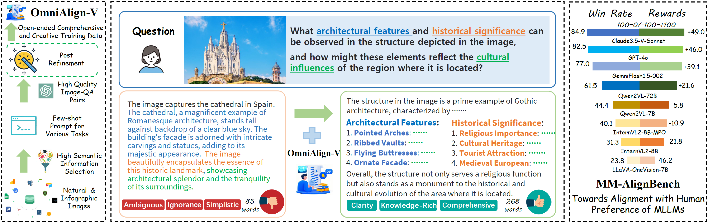
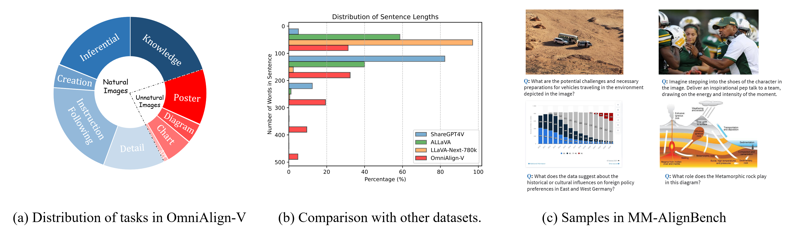
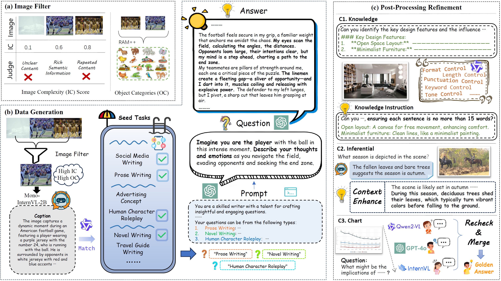
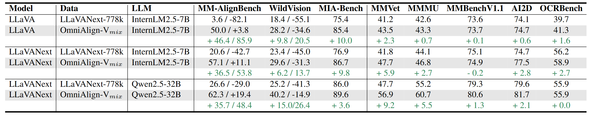
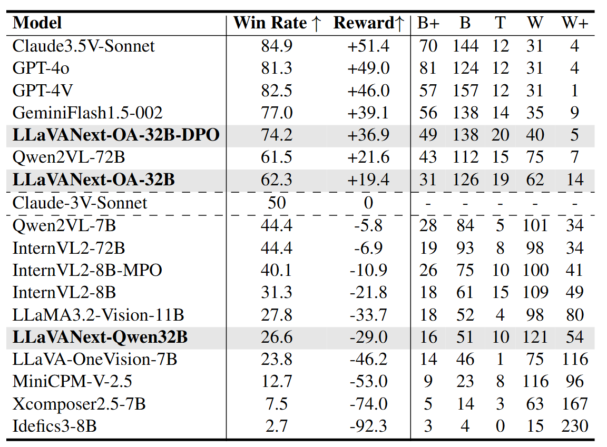

# OmniAlign-V: Towards Enhanced Alignment of MLLMs with Human Preference

 [Xiangyu Zhao](https://scholar.google.com/citations?user=eqFr7IgAAAAJ&hl=zh-TW&oi=ao)\*, Shengyuan Ding\*, [Zicheng Zhang](https://zzc-1998.github.io/), [Haian Huang](https://github.com/hhaAndroid), [Maosong Cao](https://scholar.google.com/citations?hl=zh-TW&user=Tpm-jYYAAAAJ), [Weiyun Wang](https://scholar.google.com/citations?hl=zh-TW&user=GJYzDkYAAAAJ), [Jiaqi Wang](https://myownskyw7.github.io/), [Xinyu Fang](https://scholar.google.com/citations?hl=zh-TW&user=QZk6nZ8AAAAJ), [Wenhai Wang](https://whai362.github.io/), [Guangtao Zhai](https://faculty.sjtu.edu.cn/zhaiguangtao/zh_CN/index.htm), Hua Yang, [Haodong Duan](https://kennymckormick.github.io/), [Kai Chen](https://chenkai.site/)

  <p align="center">
    <a href=''>
      
    </a>
    <a href='https://phoenixz810.github.io/OmniAlign-V/'>
      
    </a>
    <a href='https://huggingface.co/datasets/PhoenixZ/OmniAlign-V'>
      
    </a>
    <a href='https://huggingface.co/datasets/PhoenixZ/OmniAlign-V-DPO'>
      
    </a>
    <a href='https://github.com/open-compass/VLMEvalKit'>
      
    </a>
  </p>
<br />
<div align="center">
  
</div>

## 🎉 News
- **\[2025/02\]** Our [paper](https://arxiv.org/abs/2406.17770), [OmniAlign-V](https://huggingface.co/datasets/PhoenixZ/OmniAlign-V), [OmniAlign-V-DPO](https://huggingface.co/datasets/PhoenixZ/OmniAlign-V-DPO), [Checkpoints]() are all released.
- **\[2025/02\]** Our **MM-AlignBench** is now supported in [VLMEvalKit](https://github.com/open-compass/VLMEvalKit), enabling quick and efficient evaluation of MLLMs.

## 📖 Introduction
<div align="center">
  
</div>

In this work, we introduce three key contributions, **OmniAlign-V SFT dataset**, **OmniAlign-V-DPO dataset**, and **MM-AlignBench**:

- **OmniAlign-V SFT Dataset**: A SFT dataset designed to improve the alignment of Multi-modal Large Language Models (MLLMs) with human preferences. It contains 205k high-quality Image-Question-Answer pairs , featuring open-ended, creative questions and long, knowledge-rich, comprehensive answers.
- **OmniAlign-V-DPO Dataset**: A specialized dataset for Direct Preference Optimization (DPO). It leverages the answers from the OmniAlign-V SFT dataset as positive samples and generates negative samples using LLaVANext-InternLM-7B with rejection sampling.
- **MM-AlignBench**: A benchmark for evaluating MLLMs' alignment with human preferences. It includes 252 high-quality, human-annotated samples  with diverse image types and open-ended questions. Modeled after Arena-style benchmarks, it uses GPT-4o as the judge model and Claude-Sonnet-3 as the reference model.


<div align="center">
  
</div>

## 🔥 Dataset Performance
Our **OmniAlign-V SFT dataset** not only significantly improves the alignment of MLLMs with human preference, but also boosts the performance of MLLMs on common downstream tasks, particularly on benchmarks like **MMVet** and **MMMU**.

<div align="center">
  
</div>

By incorporating a DPO stage using our **OmniAlign-V-DPO dataset**, we achieve even better alignment with human preferences. Notably, our **LLaVANext-OA-32B** model, built on the Qwen2.5-32B-Instruct foundation, surpasses **Qwen2VL-72B** on the MM-AlignBench.


## 📚 MM-AlignBench
MM-AlignBench is now supported in [VLMEvalKit](https://github.com/open-compass/VLMEvalKit), a powerful toolkit for evaluating over 200 MLLMs across various benchmarks. For more details, check out the VLMEvalKit repository .

<div align="center">
  
</div>


## 🛠️ Quick Start

### Installation

- It is recommended to build a Python-3.10 virtual environment using conda

  ```bash
  conda create --name omnialign-env python=3.10 -y
  conda activate omnialign-env
  ```

- Install XTuner from source

  ```shell
  git clone https://github.com/PhoenixZ810/MG-LLaVA.git
  cd OmniAlign-V
  pip install -e '.[all]'
  ```

We conduct our experiments on ```transformers==4.37.2```, ```torch=2.1.3```, ```cuda=12.1```, ```flash_attn=2.5.5```. It is recommended to use the same version to avoid potential issues.
### Data Preparation

<!-- Please refer to [dataset_prepare.md](dataset_prepare.md). -->
- Pretrain Data: We use ALLaVA-pretrain and LLaVA-pretrain-558k as our pretrain data.
- SFT Data: We use the multi-modal data with in LLaVA-Next-SFT-778K and [OmniAlign-V-SFT](https://huggingface.co/datasets/PhoenixZ/OmniAlign-V) datasets in SFT stage.
- DPO: We only use [OmniAlign-V-DPO](https://huggingface.co/datasets/PhoenixZ/OmniAlign-V-DPO) in DPO stage.

If you want to use OmniAlign-V in sft and dpo stage, please put the data in below structure:
```
- playground
  - data
    - OmniAlign_V
      - images
        - knowledge
          - knowledge_1.jpg
        ...
    - OmniAlign_V_DPO
      - images
        ...
```
Our codebase utilize `meta_path.json` to flexiblely load different kind of data. You can modify the `meta_path.json` to load the data like:
```
{
    "LLaVANext": {
        "root": "PATH_TO_DATA",
        "annotation": "PATH_TO_ANNOTATION",
        "data_augment": false,
        "repeat_time": 1,
        "length": LENGTH,
        "data_type": "llava-next"
    },
    "OmniAlign_V_knowledge": {
        "root": "playground/data",
        "annotation": "playground/data/OmniAlign_V/knowledge.jsonl",
        "data_augment": false,
        "repeat_time": 1,
        "length": 40813,
        "data_type": "knowledge"
    },
    "OmniAlign_V_inferential": {
        "root": "playground/data",
        "annotation": "playground/data/OmniAlign_V/inferential.jsonl",
        "data_augment": false,
        "repeat_time": 1,
        "length": 37117,
        "data_type": "inferential"
    },
    ...
}
```
### Model Weights
Our checkpoints are available at HuggingFace [ModelZoo](https://huggingface.co/collections/PhoenixZ/omnialign-v-67b591ac7aaae267db319971).

- LLaVANext-OmniAlign-7B is based on [InternLM2.5-7B-chat](https://huggingface.co/internlm/internlm2_5-7b-chat)

- LLaVANext-OmniAlign-32B is based on [Qwen2.5-32B-Instruct](https://huggingface.co/Qwen/Qwen2.5-32B-Instruct).

### Before Train
We employ [CLIP-Large-336](https://huggingface.co/openai/clip-vit-large-patch14-336) as visual encoder. you should download both the LLM and CLIP checkpoints before training.

### Train & Evaluation within One Command
Before each training stage, you should modify the `meta-data`, `model_path`, `name`

**Pretrain Stage**

- Use this command to pretrain the model:
```
bash scripts/pretrain.sh
```

**SFT Stage**

Our code supports start SFT training and evaluation in one command by integrating [VLMEvalKit](https://github.com/open-compass/VLMEvalKit) in our repo.

- Specifically, `run.py` file from VLMEvalKit has been modified and renamed to `eval_run.py` in this repository.
- To use this feature, users must clone and install VLMEvalKit:
```
git clone https://github.com/open-compass/VLMEvalKit.git
cd VLMEvalKit
pip install -e .
```
- Once installed, the following command starts both training and evaluation:
```
bash scripts/llavanext_anyres/sft_AR4_llavanext.sh
```
- More details of using VLMEvalKit can be found in [VLMEvalKit](https://github.com/open-compass/VLMEvalKit) repo.

**DPO Stage**

- Similar to the SFT stage, DPO training and evaluation can be started with a single command:
```
bash scripts/dpo/dpo_anyres.sh
```

**Evaluation Only**

- If you just want to evaluate the model, you can use the following command:
```
torchrun --nproc_per_node 8\
    eval_run.py \
    --data MMAlignBench \
    --model YOUR_MODEL_NAME # Used to create save dir \
    --path PATH_TO_CHECKPOINT \
    --reuse \
```

## Citation
If you find OmniAlign-V useful, please cite using this BibTeX:
```bibtex
@article{zhao2024mg,
  title={MG-LLaVA: Towards Multi-Granularity Visual Instruction Tuning},
  author={Zhao, Xiangyu and Li, Xiangtai and Duan, Haodong and Huang, Haian and Li, Yining and Chen, Kai and Yang, Hua},
  journal={arXiv preprint arXiv:2406.17770},
  year={2024}
}
```
## Acknowledgement
- [LLaVA](https://github.com/haotian-liu/LLaVA): Base model structure.
- [InternVL](https://github.com/OpenGVLab/InternVL): InternVL structure.
- [VLMEvalkit](https://github.com/open-compass/VLMEvalKit): Evaluation tool.